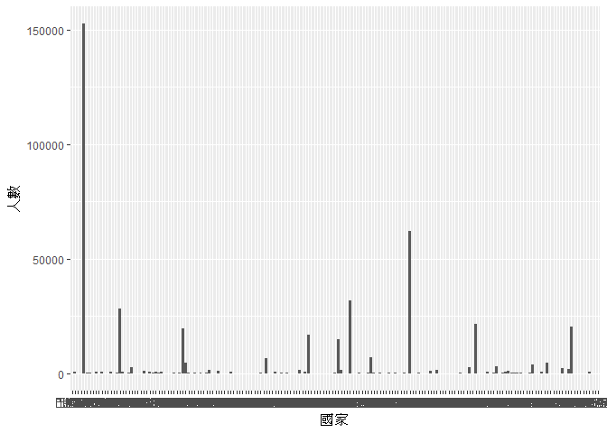
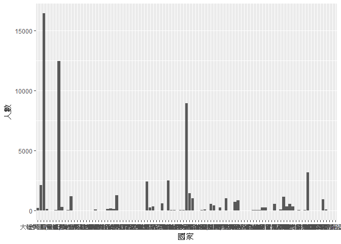

106-2 大數據分析方法 作業二
================
Yi-Ju Tseng

作業完整說明[連結](https://docs.google.com/document/d/1aLGSsGXhgOVgwzSg9JdaNz2qGPQJSoupDAQownkGf_I/edit?usp=sharing)

學習再也不限定在自己出生的國家，台灣每年有許多學生選擇就讀國外的大專院校，同時也有人多國外的學生來台灣就讀，透過分析[大專校院境外學生人數統計](https://data.gov.tw/dataset/6289)、[大專校院本國學生出國進修交流數](https://data.gov.tw/dataset/24730)、[世界各主要國家之我國留學生人數統計表](https://ws.moe.edu.tw/Download.ashx?u=C099358C81D4876CC7586B178A6BD6D5062C39FB76BDE7EC7685C1A3C0846BCDD2B4F4C2FE907C3E7E96F97D24487065577A728C59D4D9A4ECDFF432EA5A114C8B01E4AFECC637696DE4DAECA03BB417&n=4E402A02CE6F0B6C1B3C7E89FDA1FAD0B5DDFA6F3DA74E2DA06AE927F09433CFBC07A1910C169A1845D8EB78BD7D60D7414F74617F2A6B71DC86D17C9DA3781394EF5794EEA7363C&icon=..csv)可以了解103年以後各大專院校國際交流的情形。請同學分析以下議題，並以視覺化的方式呈現分析結果，呈現103年以後大專院校國際交流的情形。

來台境外生分析
--------------

### 資料匯入與處理

``` r
library(readr)
```

    ## Warning: package 'readr' was built under R version 3.4.4

``` r
library(dplyr)
```

    ## 
    ## Attaching package: 'dplyr'

    ## The following objects are masked from 'package:stats':
    ## 
    ##     filter, lag

    ## The following objects are masked from 'package:base':
    ## 
    ##     intersect, setdiff, setequal, union

``` r
library(ggplot2)
```

    ## Warning: package 'ggplot2' was built under R version 3.4.4

``` r
library(knitr)
```

    ## Warning: package 'knitr' was built under R version 3.4.4

``` r
X103_ab103_C <- read_csv("C:/Users/User/Desktop/HW2/103_ab103_C.csv")
```

    ## Parsed with column specification:
    ## cols(
    ##   洲別 = col_character(),
    ##   國別 = col_character(),
    ##   `學位生-正式修讀學位外國生` = col_integer(),
    ##   `學位生-僑生(含港澳)` = col_integer(),
    ##   `學位生-正式修讀學位陸生` = col_integer(),
    ##   `非學位生-外國交換生` = col_integer(),
    ##   `非學位生-外國短期研習及個人選讀` = col_integer(),
    ##   `非學位生-大專附設華語文中心學生` = col_integer(),
    ##   `非學位生-大陸研修生` = col_integer(),
    ##   `非學位生-海青班` = col_integer(),
    ##   境外專班 = col_integer()
    ## )

``` r
X103_ab103_S <- read_csv("C:/Users/User/Desktop/HW2/103_ab103_S.csv")
```

    ## Parsed with column specification:
    ## cols(
    ##   學校類型 = col_character(),
    ##   學校代碼 = col_character(),
    ##   學校名稱 = col_character(),
    ##   `學位生-正式修讀學位外國生` = col_integer(),
    ##   `學位生-僑生(含港澳)` = col_integer(),
    ##   `學位生-正式修讀學位陸生` = col_integer(),
    ##   `非學位生-外國交換生` = col_integer(),
    ##   `非學位生-外國短期研習及個人選讀` = col_integer(),
    ##   `非學位生-大專附設華語文中心學生` = col_integer(),
    ##   `非學位生-大陸研修生` = col_character(),
    ##   `非學位生-海青班` = col_integer(),
    ##   境外專班 = col_integer()
    ## )

``` r
X104_ab104_C <- read_csv("C:/Users/User/Desktop/HW2/104_ab104_C.csv")
```

    ## Parsed with column specification:
    ## cols(
    ##   洲別 = col_character(),
    ##   國別 = col_character(),
    ##   `學位生-正式修讀學位外國生` = col_integer(),
    ##   `學位生-僑生(含港澳)` = col_integer(),
    ##   `學位生-正式修讀學位陸生` = col_integer(),
    ##   `非學位生-外國交換生` = col_integer(),
    ##   `非學位生-外國短期研習及個人選讀` = col_integer(),
    ##   `非學位生-大專附設華語文中心學生` = col_integer(),
    ##   `非學位生-大陸研修生` = col_integer(),
    ##   `非學位生-海青班` = col_integer(),
    ##   境外專班 = col_integer()
    ## )

``` r
X104_ab104_S <- read_csv("C:/Users/User/Desktop/HW2/104_ab104_S.csv")
```

    ## Parsed with column specification:
    ## cols(
    ##   學校類型 = col_character(),
    ##   學校代碼 = col_character(),
    ##   學校名稱 = col_character(),
    ##   `學位生-正式修讀學位外國生` = col_integer(),
    ##   `學位生-僑生(含港澳)` = col_integer(),
    ##   `學位生-正式修讀學位陸生` = col_integer(),
    ##   `非學位生-外國交換生` = col_integer(),
    ##   `非學位生-外國短期研習及個人選讀` = col_integer(),
    ##   `非學位生-大專附設華語文中心學生` = col_integer(),
    ##   `非學位生-大陸研修生` = col_character(),
    ##   `非學位生-海青班` = col_integer(),
    ##   境外專班 = col_integer()
    ## )

``` r
X105_ab105_C <- read_csv("C:/Users/User/Desktop/HW2/105_ab105_C.csv")
```

    ## Parsed with column specification:
    ## cols(
    ##   洲別 = col_character(),
    ##   國別 = col_character(),
    ##   學位生_正式修讀學位外國生 = col_integer(),
    ##   `學位生_僑生(含港澳)` = col_integer(),
    ##   學位生_正式修讀學位陸生 = col_integer(),
    ##   非學位生_外國交換生 = col_integer(),
    ##   非學位生_外國短期研習及個人選讀 = col_integer(),
    ##   非學位生_大專附設華語文中心學生 = col_integer(),
    ##   非學位生_大陸研修生 = col_integer(),
    ##   非學位生_海青班 = col_integer(),
    ##   境外專班 = col_integer()
    ## )

``` r
X105_ab105_S <- read_csv("C:/Users/User/Desktop/HW2/105_ab105_S.csv")
```

    ## Parsed with column specification:
    ## cols(
    ##   學校類型 = col_character(),
    ##   學校代碼 = col_character(),
    ##   學校名稱 = col_character(),
    ##   學位生_正式修讀學位外國生 = col_integer(),
    ##   `學位生_僑生(含港澳)` = col_integer(),
    ##   學位生_正式修讀學位陸生 = col_integer(),
    ##   非學位生_外國交換生 = col_integer(),
    ##   非學位生_外國短期研習及個人選讀 = col_integer(),
    ##   非學位生_大專附設華語文中心學生 = col_integer(),
    ##   非學位生_大陸研修生 = col_integer(),
    ##   非學位生_海青班 = col_integer(),
    ##   境外專班 = col_integer()
    ## )

``` r
X106_ab105_C <- read_csv("C:/Users/User/Desktop/HW2/106_ab105_C.csv")
```

    ## Parsed with column specification:
    ## cols(
    ##   洲別 = col_character(),
    ##   國別 = col_character(),
    ##   學位生_正式修讀學位外國生 = col_integer(),
    ##   `學位生_僑生(含港澳)` = col_integer(),
    ##   學位生_正式修讀學位陸生 = col_integer(),
    ##   非學位生_外國交換生 = col_integer(),
    ##   非學位生_外國短期研習及個人選讀 = col_integer(),
    ##   非學位生_大專附設華語文中心學生 = col_integer(),
    ##   非學位生_大陸研修生 = col_integer(),
    ##   非學位生_海青班 = col_integer(),
    ##   境外專班 = col_integer()
    ## )

``` r
X106_ab105_S <- read_csv("C:/Users/User/Desktop/HW2/106_ab105_S.csv")
```

    ## Parsed with column specification:
    ## cols(
    ##   學校類型 = col_character(),
    ##   學校代碼 = col_character(),
    ##   學校名稱 = col_character(),
    ##   學位生_正式修讀學位外國生 = col_integer(),
    ##   `學位生_僑生(含港澳)` = col_integer(),
    ##   學位生_正式修讀學位陸生 = col_integer(),
    ##   非學位生_外國交換生 = col_integer(),
    ##   非學位生_外國短期研習及個人選讀 = col_integer(),
    ##   非學位生_大專附設華語文中心學生 = col_integer(),
    ##   非學位生_大陸研修生 = col_integer(),
    ##   非學位生_海青班 = col_integer(),
    ##   境外專班 = col_integer()
    ## )

讀入8筆從103~106年的資料(國別、校別)

### 哪些國家來台灣唸書的學生最多呢？

``` r
ctotal<-full_join(X103_ab103_C,X104_ab104_C,by="國別")
ctotal<-full_join(ctotal,X105_ab105_C,by="國別")
ctotal<-full_join(ctotal,X106_ab105_C,by="國別")

cselect<-select(ctotal,c(2:41),-starts_with("洲別"))
cselect[is.na(cselect)] <- 0

for (n in 1:177){ 
cselect$TOTAL[n]<-sum(cselect[n,2:37])
}
```

    ## Warning: Unknown or uninitialised column: 'TOTAL'.

``` r
Q1<-data.frame(國家=cselect$國別,
               人數=cselect$TOTAL)
Q1<-arrange(Q1,desc(人數))
```

    ## Warning: package 'bindrcpp' was built under R version 3.4.4

``` r
knitr::kable(head(Q1,10))
```

| 國家     |  人數  |
|:---------|:------:|
| 中國大陸 | 152524 |
| 馬來西亞 |  62031 |
| 香港     |  31940 |
| 日本     |  28200 |
| 越南     |  21670 |
| 澳門     |  20302 |
| 印尼     |  19620 |
| 南韓     |  16948 |
| 美國     |  14846 |
| 泰國     |  7035  |

### 哪間大學的境外生最多呢？

``` r
stotal<-full_join(X103_ab103_S,X104_ab104_S,by="學校名稱")
stotal<-full_join(stotal,X105_ab105_S,by="學校名稱")
stotal<-full_join(stotal,X106_ab105_S,by="學校名稱")
sselect<-select(stotal,c(3:45),-contains("學校代碼"),-contains("學校類型"))
sselect$`非學位生-大陸研修生.x`<-gsub("…","0",sselect$`非學位生-大陸研修生.x`)
sselect$`非學位生-大陸研修生.y`<-gsub("…","0",sselect$`非學位生-大陸研修生.y`)
sselect$`非學位生-大陸研修生.x`<-as.numeric(sselect$`非學位生-大陸研修生.x`)
sselect$`非學位生-大陸研修生.y`<-as.numeric(sselect$`非學位生-大陸研修生.y`)

sselect[is.na(sselect)] <- 0
for (n in 1:165){ 
  sselect$TOTAL[n]<-sum(sselect[n,2:37])
}
```

    ## Warning: Unknown or uninitialised column: 'TOTAL'.

``` r
Q1_1<-data.frame(學校=sselect$學校名稱,
                 人數=sselect$TOTAL)
Q1_1<-arrange(Q1_1,desc(人數))
knitr::kable(head(Q1_1,10))
```

| 學校             |  人數 |
|:-----------------|:-----:|
| 無法區分校別     | 92586 |
| 國立臺灣師範大學 | 22113 |
| 國立臺灣大學     | 18199 |
| 中國文化大學     | 16074 |
| 銘傳大學         | 16057 |
| 淡江大學         | 13887 |
| 國立政治大學     | 11626 |
| 國立成功大學     | 10982 |
| 輔仁大學         |  9499 |
| 逢甲大學         |  9474 |

### 各個國家來台灣唸書的學生人數條狀圖

``` r
ggplot()+geom_bar(data=Q1,
                  aes(x=國家,y=人數),
                  stat = "identity") 
```



### 各個國家來台灣唸書的學生人數面量圖

``` r
#這是R Code Chunk
```

台灣學生國際交流分析
--------------------

### 資料匯入與處理

``` r
Student<- read_csv("C:/Users/User/Desktop/HW2/Student_RPT_07 .csv",skip=2)
```

    ## Warning: Missing column names filled in: 'X1' [1], 'X2' [2], 'X7' [7],
    ## 'X8' [8], 'X9' [9], 'X10' [10]

    ## Parsed with column specification:
    ## cols(
    ##   X1 = col_integer(),
    ##   X2 = col_integer(),
    ##   設立別 = col_character(),
    ##   學校類別 = col_character(),
    ##   學校代碼 = col_character(),
    ##   學校名稱 = col_character(),
    ##   X7 = col_integer(),
    ##   X8 = col_character(),
    ##   X9 = col_character(),
    ##   X10 = col_character(),
    ##   中文名稱 = col_character(),
    ##   英文名稱 = col_character(),
    ##   小計 = col_integer(),
    ##   男 = col_integer(),
    ##   女 = col_integer()
    ## )

    ## Warning in rbind(names(probs), probs_f): number of columns of result is not
    ## a multiple of vector length (arg 1)

    ## Warning: 10 parsing failures.
    ## row # A tibble: 5 x 5 col     row col   expected               actual                        file    expected   <int> <chr> <chr>                  <chr>                         <chr>   actual 1 23579 X7    no trailing characters A2                            'C:/Us~ file 2 34284 X7    no trailing characters A2                            'C:/Us~ row 3 35022 X1    an integer             蝯梯?隤芣?嚗?                 'C:/Us~ col 4 35023 X1    no trailing characters ". ?祈”閮剔??乩??\uf2e7\u0080\ue~ 'C:/Us~ expected 5 35024 X1    no trailing characters ". ?祈”?\uf5fa飛?嗚\u0080\uf696~ 'C:/Us~
    ## ... ................. ... .......................................................................... ........ .......................................................................... ...... .......................................................................... .... .......................................................................... ... ..................................................................... ... .......................................................................... ........ ..........................................................................
    ## See problems(...) for more details.

``` r
Student$X10<-gsub("共和國","",Student$X10)
Student$X10<-gsub("王國","",Student$X10)
Student$X10<-gsub("聯邦","",Student$X10)
Student$X10<-gsub("民主","",Student$X10)
Student$X10<-gsub("意志","國",Student$X10)
Student$X10<-gsub("合眾國","",Student$X10)
Student$X10<-gsub("社會主義","",Student$X10)
Student$X10<-gsub("和平之國","",Student$X10)
Student$X10<-gsub("侯國","",Student$X10)
Student$X10<-gsub("印度尼西亞","印尼",Student$X10)
Student$X10<-gsub("大陸地區","中國大陸",Student$X10)
Student$X10<-gsub("哈什米","",Student$X10)
Student$X10<-gsub("阿拉伯","",Student$X10)
Student$X10<-gsub("蒙古國","蒙古",Student$X10)
```

### 台灣大專院校的學生最喜歡去哪些國家進修交流呢？

``` r
Cdata<-group_by(Student,X10)%>%
  summarise(sumC=sum(小計))
Cdata<-arrange(Cdata,desc(sumC))
colnames(Cdata)[1]<-"國家"
colnames(Cdata)[2]<-"人數"
knitr::kable(head(Cdata,10))
```

| 國家           |  人數 |
|:---------------|:-----:|
| 中國大陸       | 16425 |
| 日本           | 12430 |
| 美國           |  8916 |
| 德國           |  3164 |
| 南韓           |  2498 |
| 法國           |  2415 |
| 大韓民國(南韓) |  2131 |
| 英國           |  1416 |
| 西班牙         |  1252 |
| 加拿大         |  1180 |

### 哪間大學的出國交流學生數最多呢？

``` r
Sdata<-group_by(Student,學校名稱)%>%
  summarise(sumC=sum(小計))
Sdata<-arrange(Sdata,desc(sumC))
colnames(Sdata)[1]<-"國家"
colnames(Sdata)[2]<-"人數"
knitr::kable(head(Sdata,10))
```

| 國家         | 人數 |
|:-------------|:----:|
| 國立臺灣大學 | 4719 |
| 淡江大學     | 3794 |
| 國立政治大學 | 3479 |
| 逢甲大學     | 2646 |
| 東海大學     | 1881 |
| 元智大學     | 1864 |
| 國立交通大學 | 1513 |
| 東吳大學     | 1457 |
| 國立成功大學 | 1397 |
| 國立臺北大學 | 1397 |

### 台灣大專院校的學生最喜歡去哪些國家進修交流條狀圖

``` r
ggplot()+geom_bar(data=Cdata,
                  aes(x=國家,y=人數),
                  stat = "identity") 
```

    ## Warning: Removed 1 rows containing missing values (position_stack).



### 台灣大專院校的學生最喜歡去哪些國家進修交流面量圖

``` r
#這是R Code Chunk
```

台灣學生出國留學分析
--------------------

### 資料匯入與處理

``` r
sum<-read_csv("C:/Users/User/Desktop/HW2/105年度世界各主要國家之我留學生人數統計表 .csv")
```

    ## Warning: Missing column names filled in: 'X4' [4], 'X5' [5], 'X6' [6]

    ## Parsed with column specification:
    ## cols(
    ##   洲別 = col_character(),
    ##   國別 = col_character(),
    ##   總人數 = col_number(),
    ##   X4 = col_character(),
    ##   X5 = col_character(),
    ##   X6 = col_character()
    ## )

### 台灣學生最喜歡去哪些國家留學呢？

``` r
sum<-arrange(sum,desc(總人數))
sumdf<-data.frame(國家=sum$國別,
                    人數=sum$總人數)
knitr::kable(head(sumdf,10))
```

| 國家     |  人數 |
|:---------|:-----:|
| 美國     | 21127 |
| 澳大利亞 | 13582 |
| 日本     |  8444 |
| 加拿大   |  4827 |
| 英國     |  3815 |
| 德國     |  1488 |
| 紐西蘭   |  1106 |
| 波蘭     |  561  |
| 馬來西亞 |  502  |
| 奧地利   |  419  |

### 台灣學生最喜歡去哪些國家留學面量圖

``` r
#這是R Code Chunk
```

綜合分析
--------

請問來台讀書與離台讀書的來源國與留學國趨勢是否相同(5分)？想來台灣唸書的境外生，他們的母國也有很多台籍生嗎？請圖文並茂說明你的觀察(10分)。
